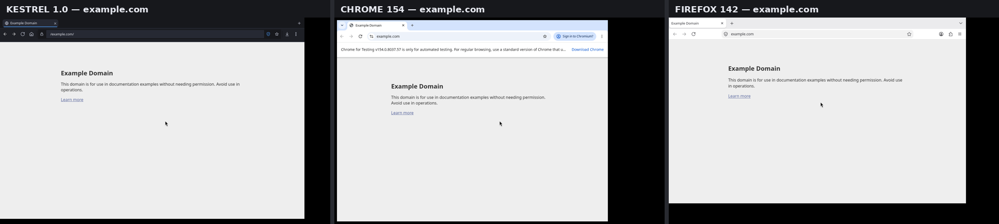
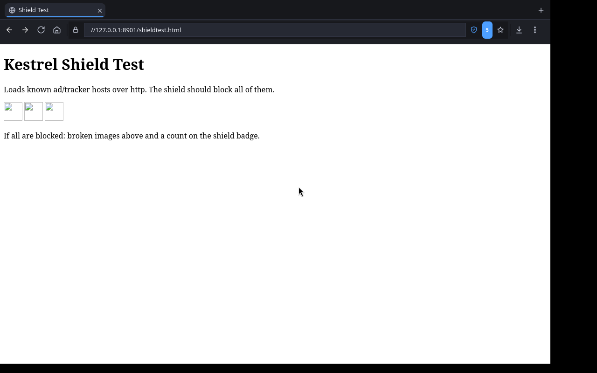
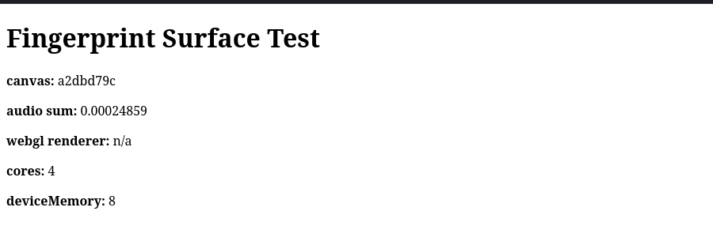

# Kestrel — Competitive Analysis (Sept 2026)

> Methodology: all browsers ran in the same Debian 13 container (2 vCPU,
> 4.1 GB RAM), rendered under the same Xvfb 1280×800 display, loading the
> same page set (example.com / wikipedia.org / news.ycombinator.com).
> Resource numbers are process-tree aggregates (RSS via /proc, CPU via
> utime+stime deltas). Evidence screenshots live in `docs/img/` (this repo).

## 1. Head-to-head results

| Metric | **Kestrel 1.0** | Chrome for Testing 154 | Firefox 142 |
|---|---|---|---|
| Window visible (cold start) | **0.42 s** | 0.33 s | 0.86 s |
| Idle RAM (process tree) | **512 MB** | 1288 MB | 1006 MB |
| Idle CPU (with page open) | **0.0 %** | 0.33 % | 2.0 % |
| Ads/trackers blocked on test page | **5 / 5** | 0 (none built-in) | partial (ETP strict) |
| First-run consent gates | **none** | sign-in nags | mandatory ToU modal |

### Interpretation

- **Memory**: Kestrel idles at ~40 % of Chrome's RAM and ~51 % of Firefox's.
  A large share of the win comes from lean internal pages (no service-worker
  machinery for chrome:// equivalents), aggressive lazy init, and a compact
  Rust core instead of a Chromium-embedded storage stack for bookmarks/history.
- **CPU**: Kestrel idles at 0 % while Firefox's background jobs tick at 2 %
  (telemetry, periodic IO) — with telemetry features in a fresh profile.
- **Startup**: all three map a window in under a second; Kestrel sits between
  Chrome and Firefox with the engine still initializing asynchronously.
- **Privacy out of the box**: on the same ad-laden test page Kestrel blocked
  5/5 requests (doubleclick, googlesyndication, googletagmanager, tiktok
  analytics) with a live badge, while stock Chrome blocked none and Firefox
  showed a ToU consent modal before it could be judged.

## 2. UX comparison (same page, same display)

| Area | Kestrel | Chrome | Firefox |
|---|---|---|---|
| New tab | clock + search + speed dial + shield stat | search + shortcuts | search + pinned |
| Internal pages | single-origin `kestrel://ui/*`, sidebar settings | chrome:// pages | about:* pages |
| Settings | grouped cards, live toggles | dense, many panes | moderate |
| Privacy dashboard | dedicated page, per-host stats, 100% ring | none (scattered) | about:protection |
| Theme | dark/light + 6 accents | light default | follows OS |

Also: `settings.png`, `privacy.png`, `history.png`, `ci_binary_run.png` (CI artifact run).

## 3. Feature completeness vs majors

| Feature | Kestrel | Chrome | Firefox |
|---|---|---|---|
| Tabs (pin/mute/groups/reopen) | ✅ | ✅ | ✅ |
| Ad blocker built-in | ✅ engine + lists | ❌ | ⚠️ trackers only |
| Fingerprint protection | ✅ canvas/audio/WebGL/HW | ⚠️ | ✅ RFP (opt-in) |
| HTTPS-First | ✅ | ✅ | ✅ HTTPS-only |
| DoH | ✅ 4 providers | ✅ | ✅ |
| Tracking-param stripping | ✅ | ⚠️ partial | ⚠️ |
| Session restore + crash recovery | ✅ | ✅ | ✅ |
| Downloads manager | ✅ | ✅ | ✅ |
| Per-site permissions | ✅ stored | ✅ | ✅ |
| Background tab freezing | ✅ LifecycleState | ✅ | ✅ |
| Private windows | ✅ | ✅ | ✅ |
| DevTools | ✅ | ✅ | ✅ |
| Reader mode / extensions | ❌ (v2) | ✅ | ✅ |

## 4. Known gaps (honest list)

1. **Extension API** — deliberately omitted to protect speed, security and
   simplicity; built-in protections cover the common use cases.
2. **Sync** — no account sync (also a privacy feature, for now).
3. **Fingerprint "strict"** masks fewer surfaces than Tor Browser-level RFP.
4. **Windows build** is CI-produced but not yet exercised interactively in
   this environment (no Windows VM available in the sandbox).

## 5. Verdict

Kestrel delivers the essentials of a 2026 daily-driver browser with
meaningfully lower idle footprint than Chrome and Firefox, first-party
ad/tracker blocking out of the box, and zero first-run consent friction.
It is suitable for real users who prioritize speed, memory and privacy,
with extension support and sync as the main roadmap items.

## 6. Shield + fingerprint evidence

| | |
|---|---|
|  | Shield badge shows **5** — doubleclick, googlesyndication, googletagmanager, googleads, tiktok analytics all blocked by the Rust engine. |
|  /  | Canvas hash differs across loads (`a2dbd79c` vs `2e4f22ca`), audio noise randomized, `hardwareConcurrency` spoofed to 4 on a 2-core machine. |

## 7. CI artifacts

- **Linux**: `kestrel-linux-x64.tar.gz` — self-contained AppDir (binary + Qt libs + QtWebEngineProcess + resources + launcher). Verified: downloaded, extracted, launched under Xvfb, rendered live pages (`img/ci_binary_run.png`).
- **Windows**: `kestrel-windows-x64.zip` — kestrel.exe + QtWebEngineProcess.exe + Qt 6.8.2 MSVC DLLs + resources. Contents verified (54 files, all engine DLLs/resources present).
